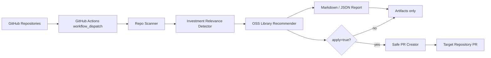

# Stock Repo Brush-up Automation

自分のGitHub配下にあるリポジトリから、株式投資・ポートフォリオ分析・バックテスト・金融データ取得に関係しそうなものを自動検出し、反映できそうなOSSライブラリを提案します。必要に応じて、対象リポジトリへ安全な改善PRを作成できます。

## できること

- GitHub上のリポジトリ名、説明、topics、README、依存関係ファイルをスキャン
- 株式投資系repoをスコアリングして抽出
- `yfinance`、`ta`、`backtesting.py`、`quantstats`、`PyPortfolioOpt`、`skfolio`、`OpenBB` などの候補を用途別に推薦
- Markdown / JSON の改善レポートを生成
- `apply=true` の時だけ、対象repoに `docs/stock-investment-brushup.md` と候補依存関係メモを追加するPRを作成
- GitHub Actions artifactとして診断結果を保存するworkflowテンプレートを同梱

> 注意: 投資助言ではありません。ここで生成される内容は、開発・分析基盤の改善案であり、売買判断を推奨するものではありません。

## 現在のActions状態

初回作成時、通常ファイルはcommit済みですが、`.github/workflows/*` の作成だけGitHub APIが `404 Not Found` を返しました。そのため、workflowは以下にテンプレートとして保存しています。

- `docs/workflows/ci.yml`
- `docs/workflows/scan-and-brushup.yml`

GitHub連携Tokenにworkflow更新権限が付与されれば、この2ファイルを `.github/workflows/` に配置するだけでCIと手動スキャンActionsが動きます。詳細は `docs/workflow-permission-recovery.md` を参照してください。

## アーキテクチャと処理の流れ

GPT Imageの最新モデルで図解しやすい構成に合わせ、入力、判定、推薦、PR作成の境界を明確にしています。READMEではMermaid図で再現可能にし、必要なら以下のプロンプトを画像生成に利用できます。

**GPT Image用プロンプト**

> GitHubリポジトリ棚卸し自動化のアーキテクチャ図。左から GitHub Repositories、GitHub Actions、Repo Scanner、Investment Relevance Detector、OSS Library Recommender、Report Generator、Safe PR Creator、Artifacts の順に流れる。各コンポーネントは初心者にも分かるアイコン付き。日本語ラベル。青と緑を基調にしたクリーンなSaaS風デザイン。



## 候補ライブラリの考え方

| 分類 | 候補 | 反映しやすいrepoの特徴 |
|---|---|---|
| 市場データ取得 | yfinance | 価格データ取得、銘柄分析、CSV更新、Yahoo Finance由来データ |
| テクニカル指標 | ta | OHLCV、RSI、MACD、ボリンジャーバンド、特徴量生成 |
| バックテスト | backtesting.py | 売買シグナル、戦略検証、移動平均クロス、手元検証 |
| 成績評価 | quantstats | リターン系列、Sharpe、drawdown、HTMLレポート |
| ポートフォリオ最適化 | PyPortfolioOpt | 平均分散、Black-Litterman、ウェイト最適化 |
| ML親和性の高い最適化 | skfolio | scikit-learn型の検証、クロスバリデーション、リスク管理 |
| 多ソース金融データ | OpenBB | ファンダメンタル、ニュース、複数データプロバイダ統合 |

## 最短の使い方

ローカルまたはCodespacesではすぐに実行できます。

```bash
python -m venv .venv
source .venv/bin/activate
pip install -e .[dev]
stock-brushup sample --output reports
stock-brushup github-scan --owner YOUR_GITHUB_OWNER --output reports --min-score 4
```

PR作成まで実行する場合:

```bash
export TARGET_GITHUB_TOKEN=github_pat_xxx
stock-brushup github-scan --owner YOUR_GITHUB_OWNER --output reports --min-score 4 --apply
```

GitHub Actionsとして動かす場合は、`docs/workflows/` のテンプレートを `.github/workflows/` に配置してください。

## 出力

- `reports/stock-investment-repo-report.md`
- `reports/recommendations.json`
- 対象repoに作るPR: `docs/stock-investment-brushup.md` と `requirements.stock-investment-brushup.txt`

## 本番運用に必要なもの

- GitHub Actionsを実行できるGitHubアカウント
- 他repoへPRを作る場合のみ、`TARGET_GITHUB_TOKEN`
  - Fine-grained tokenなら対象repoへの `Contents: Read and write`、`Pull requests: Read and write`
  - Public repoの棚卸しのみなら書き込み権限は不要
- workflowファイルをAPIで作成・更新する場合は、GitHub連携Token側のworkflow更新権限
- 金融データAPIキーは不要。このツール自体はrepo診断だけを行います

## 主要ファイル

- `stock_repo_brushup/cli.py`: CLIエントリポイント
- `stock_repo_brushup/detector.py`: 株式投資系repoの検出
- `stock_repo_brushup/recommendations.py`: OSSライブラリ推薦
- `stock_repo_brushup/github_client.py`: GitHub API連携とPR作成
- `docs/workflows/ci.yml`: CI workflowテンプレート
- `docs/workflows/scan-and-brushup.yml`: 棚卸し/PR作成workflowテンプレート
- `docs/architecture.md`: 詳細アーキテクチャ
- `docs/setup.md`: 初期設定ガイド
- `docs/workflow-permission-recovery.md`: workflow反映エラー復旧ガイド

## 開発

```bash
pip install -e .[dev]
ruff check .
pytest -q
```

## ライセンス

MIT
