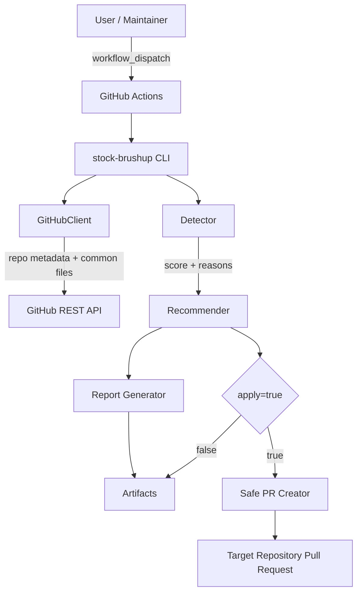
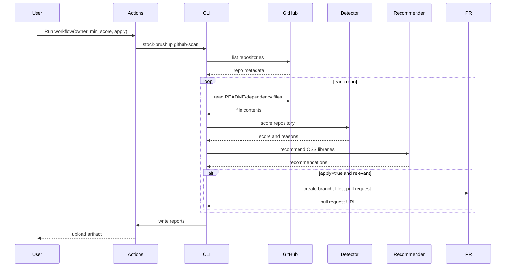

# アーキテクチャ

## 目的

このrepoは、GitHub上の既存リポジトリから株式投資に関係しそうなものを探し、反映できそうなOSSライブラリを提案し、必要なら安全なPRを作るための自動化ツールです。

## 全体像

## コンポーネント

### 1. GitHub Actions

`scan-and-brushup.yml` は手動実行用workflowです。`owner`、`min_score`、`apply`、`limit` を受け取り、対象owner配下のrepoをスキャンします。

### 2. CLI

`stock_repo_brushup/cli.py` が入口です。主なサブコマンドは以下です。

- `github-scan`: GitHub API経由でrepoをスキャン
- `scan-local`: ローカルディレクトリ配下をスキャン
- `sample`: サンプルデータでレポート生成

### 3. Detector

`detector.py` はrepo名、説明、topics、README、依存関係ファイルから株式投資関連度を計算します。日本語キーワードにも対応しています。

### 4. Recommender

`recommendations.py` は検出結果と既存依存関係をもとに候補ライブラリを推薦します。既に入っているライブラリは原則として再推薦しません。

### 5. GitHubClient

`github_client.py` はGitHub REST APIを標準ライブラリだけで呼び出します。PR作成時は、既存コードを直接変更せず、以下の安全なファイルのみ追加・更新します。

- `docs/stock-investment-brushup.md`
- `requirements.stock-investment-brushup.txt`

### 6. Report Generator

`report.py` はMarkdownとJSONを生成します。GitHub Actions artifactとして保存されます。

## 処理シーケンス

## Secrets

| Secret | 必須 | 用途 |
|---|---:|---|
| `TARGET_GITHUB_TOKEN` | PR作成時のみ | 対象repoへのContents/Pull requests権限 |

GitHub Actions標準の `GITHUB_TOKEN` は、このrepo自身の権限に限定されるため、他repoへPRを作る用途では `TARGET_GITHUB_TOKEN` を使います。

## 設計上の安全策

- デフォルトではPRを作りません
- `apply=true` でも既存コードは変更しません
- 追加するのは改善提案ドキュメントと候補requirementsだけです
- 実データ、口座情報、APIキーを扱いません
- 投資判断ではなく開発基盤改善に限定します

## 今後の拡張案

- 既存コード構成に応じた実装PR生成
- Notebookの静的解析
- Dependabot設定の自動追加
- ライブラリごとのサンプル最小実装の追加
- Streamlit / FastAPI / Jupyter などrepo種別ごとのテンプレート分岐
